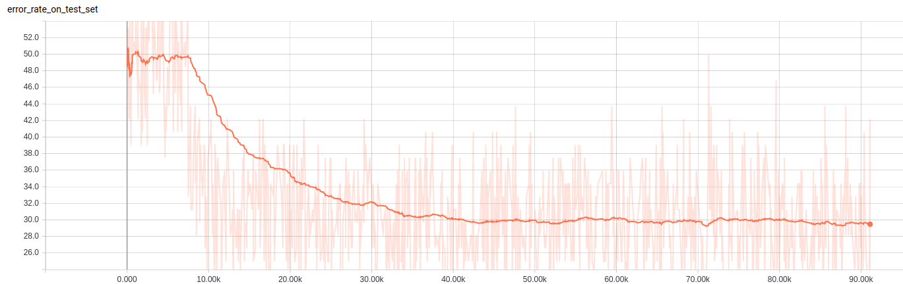
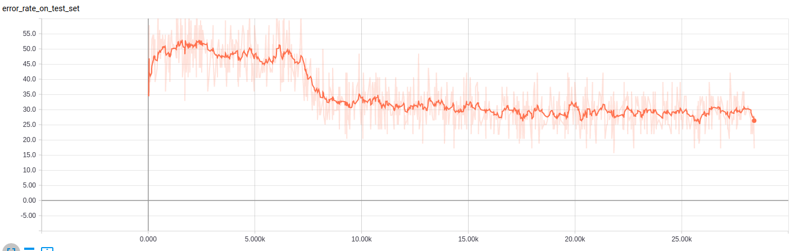

This project is developed for Python3.5 interpreter on linux machine. Using Anaconda virtual environment is recommended.

To install dependencies, simply run:

```pip install -r requirment.txt```

This project uses TensorFlow, a machine learning library developed and maintained by Google in principle.

We use tensorflow version 1.4.0 ***(required)***,

```pip install https://storage.googleapis.com/tensorflow/linux/cpu/tensorflow-1.4.0-cp35-cp35m-linux_x86_64.whl```

users can choose to install its GPU optimized version accordingly,

```pip install https://storage.googleapis.com/tensorflow/linux/gpu/tensorflow_gpu-1.4.0-cp35-cp35m-linux_x86_64.whl```

To install cv2 in Anaconda (optional):

```conda install -c menpo opencv=2.4.11```

Or via pip:

```pip install opencv-python```

## Data set

Small galaxy zoo is available at [https://www.kaggle.com/c/galaxy-zoo-the-galaxy-challenge/data](https://www.kaggle.com/c/galaxy-zoo-the-galaxy-challenge/data). I downloaded and used only the training images and training labels.

To see how I select images that has either elliptical or sprial galaxies, checkout the jupyter notebook in ```data``` folder. Every images is resized to 212x212 pixels.

To see how does the overlapping work, checkout the ```python galaxy_data.py``` once you have the data set ready. Every overlapping images is made from two randomly selected galaxies images with lower or equal to 50 piexls offest on both axises from their center. The label of each galaxy image is a one hot vector with two elements represent either it is elliptical or spiral, the synthesized label is made from the result of ```logical or``` operation.

## Train & Test

Simply,

```python galaxy_main.py```

## Result



After 90,000 batch iterations (32 overlapping images per batch) with 1e-4 learning rate, the model reaches around 30% error rate on the test data set. I retrain the model twice and it spits out the same result.

Below is another learning curve for 1e-3 learning rate achieve achieve the same performace in 10,000 batch iterations



In comparison to [https://github.com/yhyu13/tf_CapsNet](https://github.com/laodar/tf_CapsNet), which is a project done on synthesized hand written digits images and is the project I mimicked , the CapsNet achieve 10% error rate on test data set. The lesson learned is that  CpasNet is capable of recognizing elliptical and spiral galaxies when they overlapped but not as good as recognizing hand written digits. One challenge I realized was the reconstruction is particularly hard for large image input, thus, this model is not trained with reconstruction error.

## TO DO

- [ ] Spiral, elliptical, irregular galaxies classification (and more diversed sythesized images)
- [ ] Find best threshold for FS/FN
- [ ] Train with AlexNet
- [ ] Change the method to generate training data: should be

(i) spiral only (no synthesized image)
(ii) elliptical only (no synthesized image)
(iii) synthesized images
(iv) false negative examples
